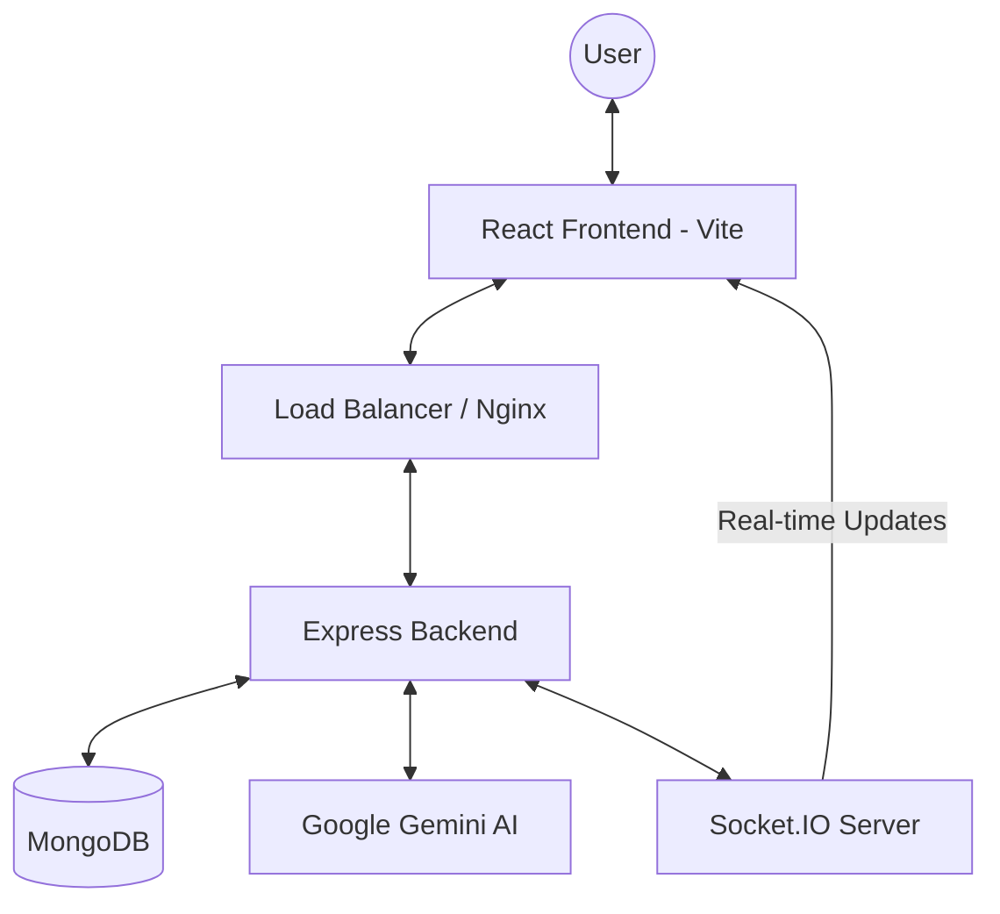

# System Design 📐

A high-level overview of the Mini AI LMS ecosystem and data flows.

---

## 🏗️ High-Level Architecture

---

## 🔄 Core Request Flows

### 1. AI Chatbot Request Flow
1. User sends a message via `ChatbotWindow`.
2. Backend receives request and calls `FuzzyService`.
3. **Stage A**: Check for Exact/Fuzzy match in `PredefinedQA`.
4. **Stage B**: If no match, `RAGService` retrieves relevant Article chunks from MongoDB.
5. **Stage C**: Query sent to `Gemini AI` with context.
6. Response returned, logged in `AIChatLog`, and sent to User.

### 2. Assignment Submission Flow
1. User submits answers via `ArticleDetail`.
2. Backend grades MCQs/MSQs instantly.
3. For **Short Answers**, `AIService` calls Gemini for rubric-based evaluation.
4. Total score, feedback, and updated `UserStats` are saved to MongoDB.
5. `Socket.IO` emits a leaderboard update event.
6. User receives immediate results and AI feedback.

---

## 🗄️ Database Schema Design

| Collection | Description | Key Fields |
|---|---|---|
| **Users** | User profiles & stats | email, role, stats (tokens, scores, streak) |
| **Articles** | Educational content | title, content, aiSummaryCache, createdBy |
| **Assignments** | Task definitions | articleId, questions (mcq/short_answer) |
| **Submissions** | User attempts | userId, assignmentId, totalScore, aiEvaluation |
| **VectorChunks**| RAG knowledge base | articleId, content, embedding (vector) |
| **PredefinedQA**| FAQ optimization | question, answer, usageCount |

---

## ⚖️ Scalability Tradeoffs
- **Denormalization**: We store `stats` directly in the `User` document for fast dashboard loading, sacrificing some write consistency for read performance.
- **Stateless Auth**: JWTs allow us to scale the backend horizontally without session affinity.
- **Fuzzy Search vs. LLM**: We prioritize local `Fuse.js` matching over Gemini API calls to save costs and reduce latency.
